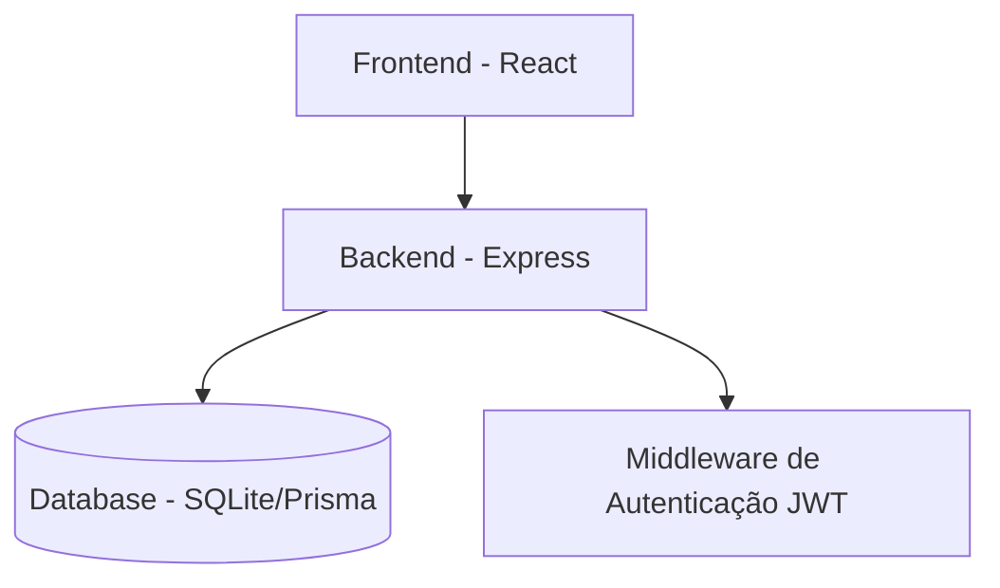

# Documentação Arquitetural - Gestor Minds (Beta 0)

Este documento descreve a estrutura, o propósito e o funcionamento dos módulos e páginas do sistema financeiro Gestor Minds.

---

## 🏗️ Estrutura Geral do Projeto

O projeto é dividido em uma arquitetura **Backend (API)** e **Frontend (Web)**, utilizando TypeScript em ambos os lados para garantir consistência e segurança de tipos.

---

## 🛠️ Backend (Pasta `backend`)

O backend segue o padrão **Repository Pattern** para separar a lógica de acesso a dados da lógica de controle (Controllers).

### 1. Núcleo (Core)
- **`prisma/schema.prisma`**: O coração do banco de dados. Define modelos como `Tenant` (Multi-empresa), `User`, `Account`, `Category`, `Transaction`, `CostCenter` e `Person`.
- **`src/app.ts`**: Ponto de entrada que configura middlewares (CORS, JSON, Cookies) e roteamento central.
- **`src/middlewares/auth.middleware.ts`**: Protege as rotas, verificando o token JWT e injetando o `tenantId` (ID da empresa/usuário) em cada requisição para isolamento de dados.

### 2. Módulos e Repositórios
- **Transactions (`transaction.repository.ts`)**: Gerencia o CRUD de lançamentos. Aplica filtros de segurança por `tenantId` em todas as consultas.
- **Transfers (`transfer.repository.ts`)**: Utiliza `prisma.$transaction` para criar dois lançamentos vinculados (saída de uma conta e entrada em outra) de forma atômica.
- **Reports (`report.repository.ts`)**: Agrega dados para exportação. Usa `exceljs` e `pdfmake` para transformar dados do banco em documentos baixáveis.
- **Dashboard (`dashboard.repository.ts`)**: Faz agregações matemáticas (SUM) para calcular saldos totais, receitas e despesas do mês, além de preparar dados para gráficos históricos.
- **Cost Centers & People**: CRUDs simples com isolamento de tenant para organizar projetos e contatos.

---

## 💻 Frontend (Pasta `frontend`)

Construído com **React**, **Vite** e **TailwindCSS**, focado em uma experiência de usuário (UX) premium e responsiva.

### 1. Componentes de Estrutura
- **`src/contexts/AuthContext.tsx`**: Gerencia o estado global de autenticação, persistindo o usuário e o token no `localStorage`.
- **`src/components/Layout.tsx`**: Define a estrutura visual comum (Sidebar lateral e Header), unificando a navegação.
- **`src/services/api.ts`**: Configuração do Axios que injeta automaticamente o token JWT no cabeçalho das requisições.

### 2. Páginas e Funcionalidades
- **Dashboard (`Dashboard.tsx`)**:
  - Exibe KPIs principais através de cards.
  - Utiliza `recharts` para renderizar gráficos de área (fluxo de caixa) e barras (comparativo mensal).
- **Lançamentos (`Transactions.tsx`)**:
  - Tabela dinâmica de movimentações.
  - Inclui modais para novo lançamento e transferências.
  - Oferece botões de exportação para Excel e PDF que consomem os streams do backend.
- **Accounts / Categories / Cost Centers / People**:
  - Páginas de gestão (CRUD) que permitem organizar os pilares do sistema financeiro.
  - Utilizam modais para manter o usuário no contexto da página.

---

## 💾 Banco de Dados e Multi-tenancy

O sistema utiliza um modelo de **Multi-tenancy via software**.
- Cada tabela possui uma coluna `tenantId`.
- Nunca uma resposta de API retorna dados que não pertencem ao `tenantId` do usuário logado.
- Durante o desenvolvimento (Beta 0), utilizamos **SQLite** para facilitar o setup inicial, mas a estrutura está pronta para migrar para **PostgreSQL** em produção apenas alterando o provider no Prisma.

---

## 🚀 Como as peças se encaixam?

1. O usuário faz login e recebe um **JWT**.
2. O frontend salva esse JWT e o envia em cada chamada à **API**.
3. O **Middleware** de auth no backend valida o token e descobre a qual empresa o usuário pertence.
4. O **Repository** usa essa informação para filtrar os dados no **Prisma**.
5. O **Frontend** recebe os dados e renderiza os componentes visuais de forma reativa.
